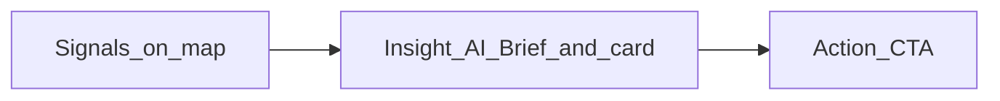

# Product requirements document — Command Center (permit intelligence, signal-driven)

## For Cursor

When building or updating UI for this concept, read this document together with the project style guide.

- `@docs/prd-permit-intelligence.md` — scope, screens, copy, and acceptance checks.
- `@docs/context/style-guide.md` — typography, color tokens, Figma links (source of truth for exact values).

**Stack:** Next.js App Router, React 19, Tailwind 4. If an API or convention is unclear, check `node_modules/next/dist/docs/` (this repo uses Next.js 16.x; it may differ from older Next docs).

**Map asset:** Use the project background map at **`public/brownsville_map.png`**. In Next.js reference it as **`/brownsville_map.png`** (full-bleed `Image` or CSS `background-image`). If the file is missing in a clone, fall back to a neutral placeholder and keep the same layout.

**Routing for the six static concept screens:** Implement as **`/concept/[screen]`** where `[screen]` is the string **`1` through `6`** (e.g. `/concept/1`, …, `/concept/6`). Invalid values should show a simple error or redirect to `/concept/1`. This keeps URLs shareable, matches mental model (“screen 3”), and avoids hash-based routing.

---

## 1. Product overview

Design a **real-time Command Center** interface so stakeholders can understand permits, detect risk from real-world **signals**, and take **action**. This phase is a **series of full-viewport concept screens** over a map—not a working product with live data.

**Core loop:** Signals → insight → action.

**Big idea:** This is **not a dashboard**. It is a **live operating surface** for the city. Every composition should feel operational, not report-like.

---

## 2. Core principle

Every UI element must answer:

1. **What signal** is being shown?
2. **What action** does it drive (or prepare the user to take)?

If an element fails that test, remove or demote it for these screens.

---

## 3. Primary surface (conceptual shell)

The full product shell includes:

| Zone | Purpose |
|------|---------|
| Full-bleed map | Geographic context and signal density |
| AI Brief | Top-left system summary |
| Filters | Top-right (optional per screen) |
| Role switcher | Left (screen 5 emphasis) |
| Detail card | Right (screens 2–3, 5) |
| KPI ticker | Bottom (screens 4–6 as needed) |

Individual screens **turn zones on or off** to tell one story each (see section 8).

---

## 4. Scope

### In scope

- Six **static** (or lightly mocked) compositions at routes **`/concept/1` … `/concept/6`**.
- Full-viewport layout over **`public/brownsville_map.png`** (`/brownsville_map.png`).
- **Mock copy** from section 7 used consistently so demos feel like one product.

### Out of scope

- Real-time backends, APIs, auth, or production permit data.
- Map SDK (Mapbox, Google Maps, etc.) unless explicitly added later.
- Fully functional filters, role persistence, or real click-through from map pins to server state.
- **Exception:** Minimal client state is OK for demo polish (e.g. toggling Planner / Mayor on screen 5) if it stays obviously fake.

---

## 5. Global layout and design rules

- **Map:** Fixed full-viewport background; overlays are `position` fixed or inset within a full-height shell. Map should read at a glance (no cramped letterboxing).
- **Panels:** Glass or elevated surface treatment; align with Figma + [style guide](./context/style-guide.md) (Primary — electric blue, Secondary — mint, semantic state colors for risk).
- **Risk:** Do not rely on color alone—pair hue with **label + icon** (e.g. “Elevated” + warning symbol).
- **Motion (where specified):** Subtle only; purpose is “live ops,” not distraction.

---

## 6. Shared mock content (use everywhere)

Use this **single fictional permit thread** so screens feel connected.

| Slot | Copy |
|------|------|
| **Permit / site name** | Westside mixed-use — 1800 E Elizabeth St |
| **Permit ID** | BLV-2026-1847 |
| **AI Brief (short)** | 3 zones heating up · Foundation backlog east of river |
| **AI Brief (longer, when needed)** | Brownsville: foundation inspections are clustering east of the river. Two corridors are driving 60% of new risk signals in the last 24 hours. |
| **Live site status headline** | Site active · Equipment on grade |
| **Live site status supporting** | Last verified 12 min ago · Excavation + rebar staging matches permit phase |
| **Health score label** | Permit health |
| **Health score value** | 62 / 100 — watch |
| **Journey step (current)** | Foundation — inspection pending |
| **AI Insight** | Signal stack: weather window narrowing + crew on site + no inspection logged in 9 days → elevated slip risk for foundation sign-off. Recommend scheduling within 48 hours. |
| **Primary CTA** | Schedule inspection |
| **Secondary actions** | Open permit file · Notify contractor · Add site note |

**KPI ticker items** (rotate or show as a row; same numbers across screen 4+ unless role view changes labels):

| Label | Value | Note for “live” feel |
|-------|--------|----------------------|
| Active permits (30d) | 412 | Small pulse or “updated just now” |
| Inspections due 7d | 38 | Optional gentle count emphasis |
| Risk-weighted backlog | 22 | Tie to heat narrative |
| Avg time to first inspection | 6.4 days | Label as “rolling 30d” |

---

## 7. Component inventory (build once, reuse)

| Concept | Responsibility |
|---------|----------------|
| **MapCanvas** | Background image + optional heat overlay layer (SVG/CSS/blob). |
| **HeatLayer** | Clusters clearly visible on screens 1, 4, 6. |
| **AIBriefChip** | Top-left; compact summary; may expand slightly on hover for demo only. |
| **DetailCard** | Right rail: journey, health score, live site status, AI insight, actions. |
| **KPITicker** | Bottom strip; “alive” treatment on screen 4. |
| **RoleSwitcher** | Planner vs Mayor (screen 5). |
| **FilterBar** | Top; includes **ghost** pills for future layers (screen 6). |
| **GhostLayerPill** | 311, Public safety, Infrastructure — low opacity, “future signal” styling. |

File and export names in code may differ; behavior and **content slots** above are canonical.

---

## 8. Screen specifications

### Screen 1 — Instant read (no interaction)

| Field | Spec |
|-------|------|
| **ID / route** | `screen-1` → `/concept/1` |
| **Goal** | Show **instant understanding** without clicking anything. |
| **Must show** | Full-bleed map; **AI Brief** chip top-left; **heat clusters** clearly visible; minimal other chrome (no detail card, no ticker required). |
| **Visual hierarchy** | Map + heat first; Brief second. Brief must be readable in one second. |
| **Signal → action** | Heat = concentration signals; Brief names *where* and *what* is heating so the user knows where to look next. |
| **Mock content** | Use **AI Brief (short)** from section 6. Heat concentrated **east of river** and **one secondary blob** west (visual only). |
| **Done when** | A new viewer can say **what is going on city-wide** in under 5 seconds without interaction. |

---

### Screen 2 — Pin to detail (“oh wow”)

| Field | Spec |
|-------|------|
| **ID / route** | `screen-2` → `/concept/2` |
| **Goal** | Show **map → pin → detail card** and make the **Live site status** feel like the hero; **AI Insight** clear and confident. |
| **Must show** | Map with a **selected pin** (Westside site); **DetailCard** open on the right; **Live site status** block largest / highest contrast in card; **AI Insight** full paragraph from section 6; secondary actions visible but quieter. |
| **Visual hierarchy** | Live site status > AI Insight > journey/health > secondary buttons. |
| **Signal → action** | Pin anchors *where*; live status = *what is true now*; insight = *why it matters*; actions = *what to do*. |
| **Mock content** | All **DetailCard** slots from section 6; pin label e.g. “Westside mixed-use.” |
| **Done when** | Viewer feels a clear **aha** linking geography to operational truth and reasoning. |

---

### Screen 3 — Action focus

| Field | Spec |
|-------|------|
| **ID / route** | `screen-3` → `/concept/3` |
| **Goal** | Show that insight **leads to action**; primary CTA obvious. |
| **Must show** | Same **DetailCard** structure as screen 2 but **tighter**: trim or collapse secondary sections if needed. **Primary CTA** (“Schedule inspection”) is the **most prominent** control. **Visual thread** for signal → insight → action: use a **vertical step strip** or **numbered rail** (1 Signal · 2 Insight · 3 Action) in the card margin or above actions—one metaphor only, keep it clean. |
| **Visual hierarchy** | Primary CTA > step strip > condensed insight > live status summary (one line OK). |
| **Signal → action** | Steps make the causal chain explicit; CTA is the payoff. |
| **Mock content** | Shorten AI Insight to two sentences max if needed; keep **Primary CTA** exact: **Schedule inspection**. |
| **Done when** | Viewer names the **one main action** without searching the card. |

---

### Screen 4 — Zoom out (city intelligence)

| Field | Spec |
|-------|------|
| **ID / route** | `screen-4` → `/concept/4` |
| **Goal** | **Bigger picture**: heat + KPIs; KPIs feel **live**, not static dashboard numbers. |
| **Must show** | Full map; **heat** visible; **KPI ticker** bottom; optional slim **AI Brief** top-left (use **AI Brief (short)**). No detail card. |
| **Visual hierarchy** | Map + heat dominate; ticker is readable but secondary. |
| **Signal → action** | Heat shows *where* pressure is; KPIs quantify *how much*; together they justify *where to deploy attention*. |
| **Mock content** | KPI row from section 6; add **“Live”** or **“Updated just now”** micro-label and **subtle motion** (pulse, soft count-up, or staggered fade-in once on load). |
| **Done when** | Viewer describes a **city-scale story** (where + how big) without opening a permit. |

---

### Screen 5 — Role-based view

| Field | Spec |
|-------|------|
| **ID / route** | `screen-5` → `/concept/5` |
| **Goal** | Show the same system **works for different people**. |
| **Must show** | **Implementation choice:** **split view** (recommended for static demo)—**left: Planner**, **right: Mayor** on one viewport. **Planner** side: detail/signals emphasis (pin + compact card or signal list + **AI Insight** snippet). **Mayor** side: trends/outcomes (small chart or trend lines + **KPI** subset + narrative line). Shared **RoleSwitcher** labels at top of each column: “Planner” / “Mayor.” Alternative: single column with **toggle** if split is too busy—pick one implementation, not both. |
| **Visual hierarchy** | Balanced columns; Planner feels operational; Mayor feels directional. |
| **Signal → action** | Planner: signal → near-term action. Mayor: trend → priority / resource narrative. |
| **Mock content** | Planner: **Live site status** one-liner + **AI Insight** first sentence. Mayor: “Foundation backlog **−12%** vs last month” style line + 2 KPIs from section 6. |
| **Done when** | Stakeholder sees **two credible modes** without thinking they are two different products. |

---

### Screen 6 — Scale (future signals)

| Field | Spec |
|-------|------|
| **ID / route** | `screen-6` → `/concept/6` |
| **Goal** | Show the surface **scales** with more inputs **without extra clutter**—future channels read as **signals**, not a feature checklist. |
| **Must show** | Full map + heat; **FilterBar** top with **active** permit/signal filter state + **ghost** pills: **311**, **Public safety**, **Infrastructure** (muted, low emphasis, “not active” styling). Optional **KPI ticker** slimmed. |
| **Visual hierarchy** | Map still primary; ghost pills must not compete with heat. |
| **Signal → action** | Bar implies **more signal classes** will feed the same loop; ghosts are **preview**, not CTA. |
| **Mock content** | Active pill e.g. “Permits · live”; ghost pills exact labels: **311**, **Public safety**, **Infrastructure**. |
| **Done when** | Viewer reads ghosts as **future inputs**, not broken buttons. |

---

## 9. Interaction model (concept-only)

| Screen | Interaction |
|--------|----------------|
| 1 | None required; static composition. |
| 2–3 | Depict selected pin + card; real click map optional. |
| 4 | Optional one-time KPI animation on load. |
| 5 | **Split view:** static OK. **Toggle variant:** clicking tab switches panel content only. |
| 6 | Static bar; ghost pills non-functional or disabled styling. |

---

## 10. Success criteria (global)

| Criterion | Meaning |
|-----------|---------|
| Risk visible in &lt;5 sec | Screen 1 (and 4) communicate pressure zones immediately. |
| Clear reason for risk | Screen 2–3 **AI Insight** explains *why* in plain language. |
| Immediate action available | Screen 3 primary CTA is unmistakable. |

---

## 11. Diagram — core loop

---

## 12. Appendix — Figma (BTX digital twin PoC)

Use these for pixels, components, and variables; the style guide duplicates links for convenience.

| Area | Link |
|------|------|
| Screen / frame (node `263-10111`) | [Open in Figma](https://www.figma.com/design/MiRWzAqwyE3YqDfq6RkQSc/BTX---Digital-Twin-PoC?node-id=263-10111&t=Lq6qSdVxqUWrXjLW-4) |
| Screen / frame (node `192-2698`) | [Open in Figma](https://www.figma.com/design/MiRWzAqwyE3YqDfq6RkQSc/BTX---Digital-Twin-PoC?node-id=192-2698&t=Lq6qSdVxqUWrXjLW-4) |
| Screen / frame (node `193-3790`) | [Open in Figma](https://www.figma.com/design/MiRWzAqwyE3YqDfq6RkQSc/BTX---Digital-Twin-PoC?node-id=193-3790&t=Lq6qSdVxqUWrXjLW-4) |
| Screen / frame (node `263-10245`) | [Open in Figma](https://www.figma.com/design/MiRWzAqwyE3YqDfq6RkQSc/BTX---Digital-Twin-PoC?node-id=263-10245&t=Lq6qSdVxqUWrXjLW-4) |
| File root | [BTX — Digital Twin PoC](https://www.figma.com/design/MiRWzAqwyE3YqDfq6RkQSc/BTX---Digital-Twin-PoC) |

---

## 13. Changelog

| Date | Change |
|------|--------|
| 2026-03-26 | Initial Cursor-ready PRD: six concept screens, shared mock copy, `/concept/[screen]` routing, component inventory. |
| 2026-03-26 | Map asset: canonical file `public/brownsville_map.png` (`/brownsville_map.png`). |
